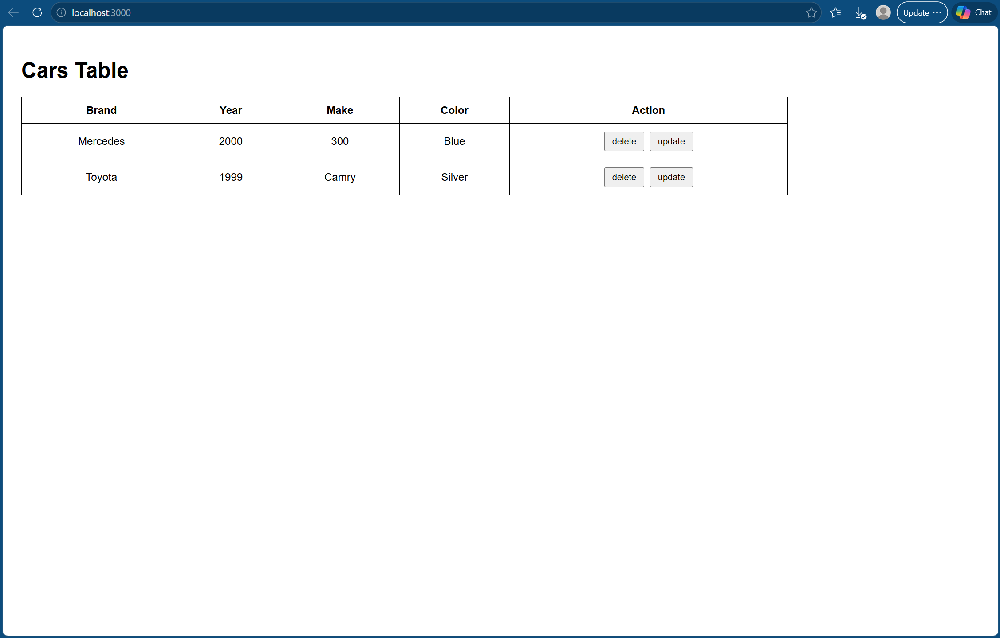
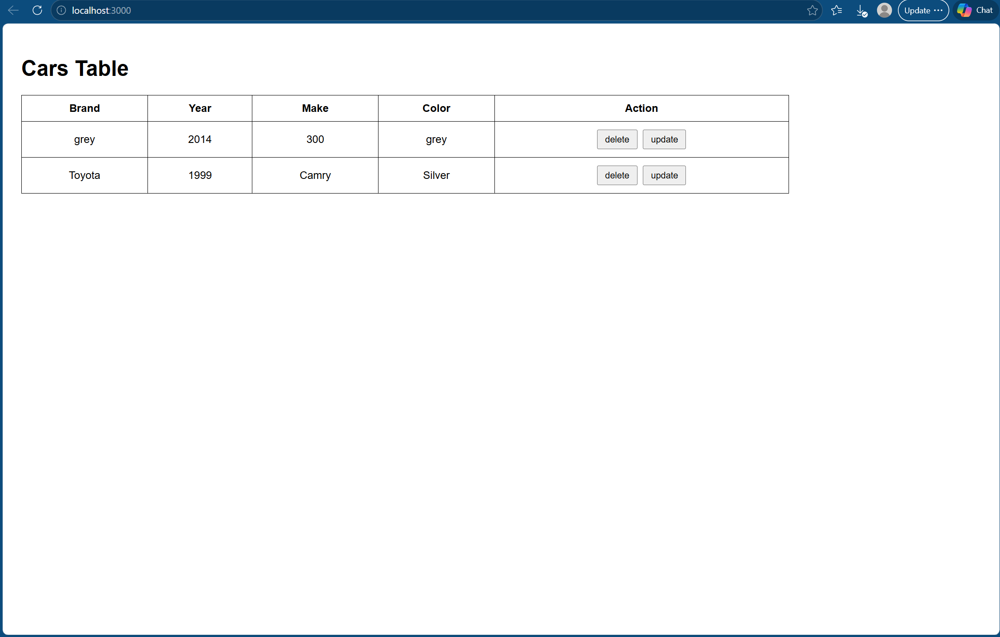
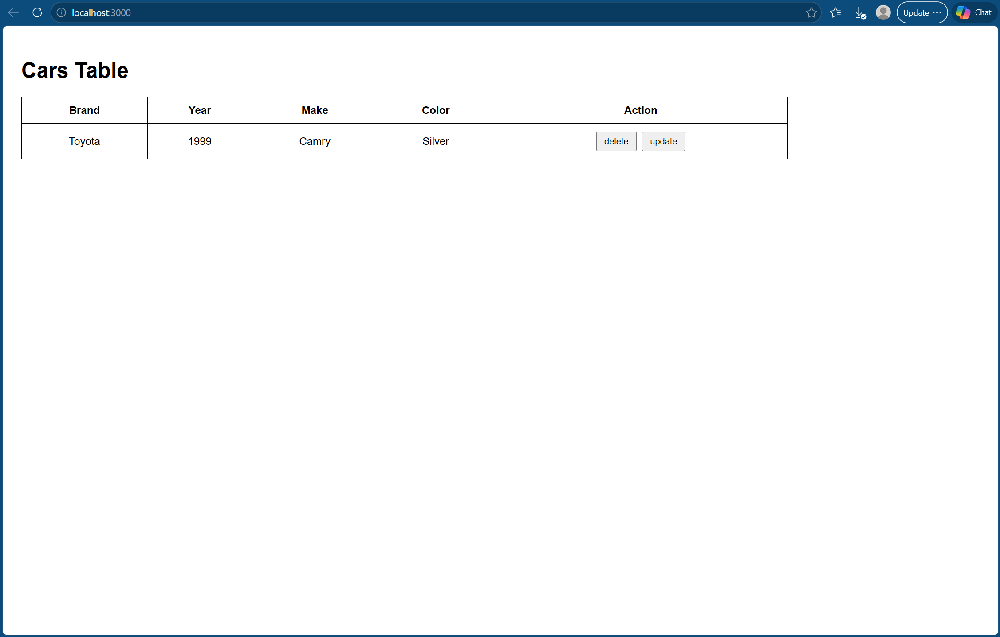

# Node 04 Cars Table

This project uses Node.js, Express, HTML, and JavaScript to display a table of cars.

## Features

- Shows cars in a table
- Delete button removes a car
- Update button changes car information
- Table refreshes automatically after changes

## How It Works

When the page loads, JavaScript sends a request to the server to get the list of cars.

The cars are displayed inside an HTML table.

Each row has:
- a delete button
- an update button

The delete button removes the selected car from the table.

The update button asks the user for new values and updates the car information.

After deleting or updating, the table reloads so the changes appear immediately.

## Screenshots

### Cars Table

### Updated Car

### Deleted Car

